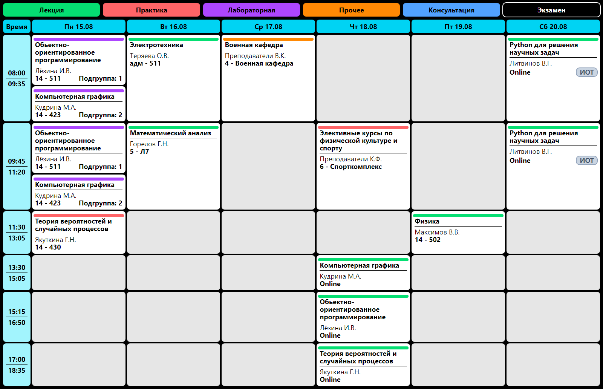
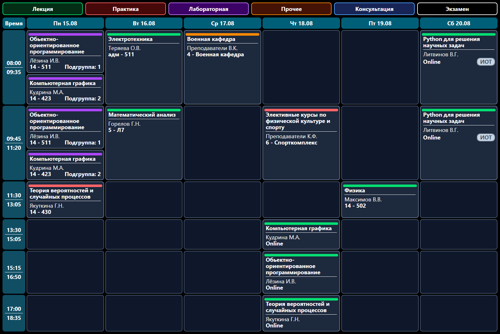
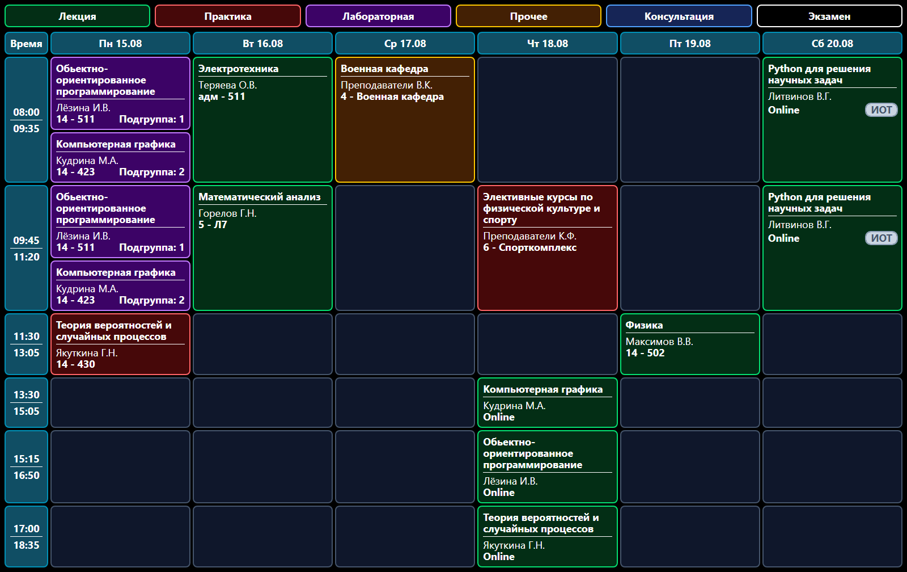

# SSAU Schedule

[](https://t.me/arai_ssau_bot)
[](https://t.me/arairon)

[](https://github.com/Arairon/ssau-schedule/actions/workflows/release.yml)
[](https://github.com/Arairon/ssau-schedule/actions/workflows/main.yml)
[](https://github.com/Arairon/ssau-schedule/actions/workflows/dev.yml)

> [!warning]
> Бот НЕ официальный! Я не имею никакого отношения к учебному отделу ССАУ, я просто студент.

Бот: [@ssau_sched_bot](https://t.me/arai_ssau_bot)

Да, это очередной бот для просмотра расписания ССАУ, но этот написан под мои хотелки, которые я не нашёл в других ботах. _По правде я не очень то и искал..._

До написания этого бота я в основном пользовался [ботом л9](https://github.com/far-galaxy/l9_stud_bot/), потом захостил его у себя, но спустя год он начал возмущаться. Мне стало лень сражаться с ним, поэтому я решил _просто_ написать своего.

## Возможности

### Как в л9

- Генерация изображений с расписанием
- Поиск групп
- Уведомления о изменениях в расписании
- Уведомления о начале пар
- Уведомления о следующих парах
- Уведомления о следующей неделе
- Включение/отключение военки
- Настройка всех уведомлений
- Календари ICS

### В отличии от л9

- Вход в личный кабинет (На данный момент обязательное условие). Довольно серьёзный минус... Но подводит к следующему пункту.
- Бот поддерживает ИОТы! Т.к. бот привязывается к аккаунту ЛК, он получает данные напрямую из личного кабинета, а не с ssau.ru/rasp. А значит и за ИОТами может следить
- Настройка подгруппы. Вы можете спокойно отфлильтровать пары по подгруппам или же оставить отображение обеих подгрупп.
- Темы для изображений
  - Светлая
    
  - Тёмная
    
  - Неоновая
    
  - И другие, если будут пожелания :D

## Минусы

В отличии от бота л9, ssau-sched написан на js и для генерации изображений использует puppeteer, из-за чего он требует мягко говоря больше ресурсов, а так же гораздо медленнее генерирует расписание. На моём сервере генерация занимает около 3 секунд, однако если недели нет в базе данных, к этим трём секундам добавляются ещё 3-5 секунд на получение данных с ССАУ.

Так же, на данный момент бот требует привязки к личному кабинету ССАУ и **по желанию пользователя** может хранить логин и пароль в зашифрованном виде в базе данных, на случай сброса сессии.
Сохранять пароль **НЕОБЯЗАТЕЛЬНО** Вы можете войти в личный кабинет и не сохранять пароль, но тогда при сбросе сессии вам придётся входить заново.

## Развёртывание

```yaml
services:
  ssau-schedule:
    image: ghcr.io/arairon/ssau-schedule:latest
    restart: unless-stopped
    container_name: ssau-schedule
    ports:
      - 3000:3000
    volumes:
      - ./log:/app/log # Необязательно
    env_file: .env
    depends_on:
      - db
  db:
    image: postgres:14
    restart: unless-stopped
    environment:
      - POSTGRES_USER=pg
      - POSTGRES_PASSWORD=pg
      - POSTGRES_DB=ssausched
    volumes:
      - ./postgres:/var/lib/postgresql/data
networks: {}
```

```sh
SCHED_BOT_TOKEN= # Токен бота
SCHED_BOT_DOMAIN= # Домен бота. Используется для генерации ICS ссылок. Например: sched.example.com
SCHED_BOT_ADMIN_TGID= # ID администратора в телеграм. Позволяет использовать отладочные команды
SCHED_BOT_ADMIN_CONTACT= # Контакт администратора. Например: @arairon
SCHED_DATABASE_URL=postgresql://pg:pg@db/ssausched # URL базы данных
SCHED_CREDENTIALS_KEY= #Длинная, случайная строка. 64 или более символов. Используется для шифрования паролей

#Необязательные поля
SCHED_PORT=3000 # Порт внутри контейнера. Можно не менять
LOG_LEVEL=info # Уровень логов. debug, info, warn, error
FASTIFY_LOG_LEVEL=error # Уровень логов Fastify. debug, info, warn, error
PRISMA_LOGS=false # Логи запросов к БД

TZ=Europe/Samara # Часовой пояс. По умолчанию Europe/Samara. Менять не рекомендуется
NODE_ENV=production # Не рекомендуется менять в продакшене. В разработке можно поставить development.
```

## Команды

В меню бота отображаются только `/schedule`, `/options` и `/help`

Полный список команд:

- `/start` - Начало работы с ботом или сброс
- `/login` - Войти в личный кабинет
- `/logout` - Выйти из личного кабинета
- `/schedule [номер недели]` - Показать расписание на указанную неделю (по умолчанию покажет текущую неделю)
- `[номер группы]` - Показать расписание для указанной группы.
  Пример: `6101`, `6101-090`, `6101-090301D`
- `[номер недели]` - Показать расписание на указанную неделю. Пример: `12`
- `/options` - Открыть настройки
- `/config [поле] [подполе?] [значение]` - Изменить параметр. (Для настроек которые не поддерживаются в `/options`)
  - `/config` - Покажет текущие параметры

### Команды администратора

> [!note]
> Команды доступны только для пользователя с TGID равным SCHED_BOT_ADMIN_TGID
>
> НЕ РЕКОМЕНДУЕТСЯ ИСПОЛЬЗОВАТЬ В ПРОДАКШЕНЕ, ЕСЛИ ВЫ НЕ ЗНАЕТЕ ЧТО ДЕЛАЕТЕ
>
> Разве что /broadcast, но и с тем осторожность не помешает

- `/broadcast [сообщение]` - Отправить сообщение всем пользователям бота
- `/broadcastTest [сообщение]` - Отправить сообщение себе для предпросмотра
- `/invalidate [поле]` - Инвалидировать кэш для указанного
  - `cache [all]` - Сброс сгенерированных расписаний и календарей для администратора. (Для всех если добавить `all`)
  - `images [hard]` - Отметит ВСЕ изображения неактуальными и затребует сверку с текущим кэшированным расписанием. Добавление `hard` удалит ВСЕ сгенерированные изображения.
  - `notifs` - Очистит очередь уведомлений для ВСЕХ пользователей.
- `/suicide` - Вызовет ошибку от бота и скорее всего крашнет его.
- `/runtask [задача]` - Выполнит задачу
  - `dailyupd` - Обновление расписания на текущую и следующую неделю, а так же постановка уведомлений на сегодняшний день для всех пользователей.
